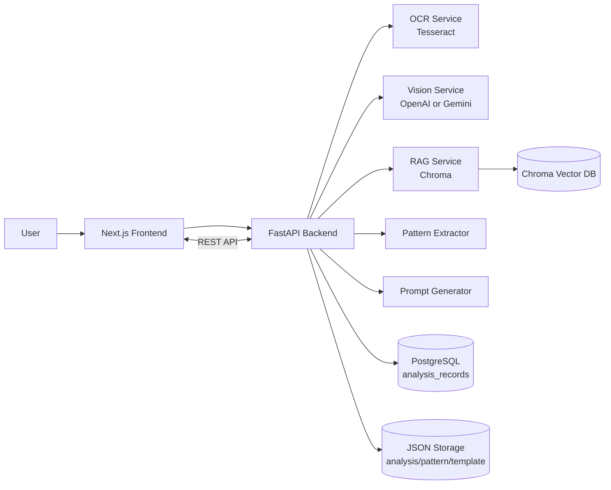
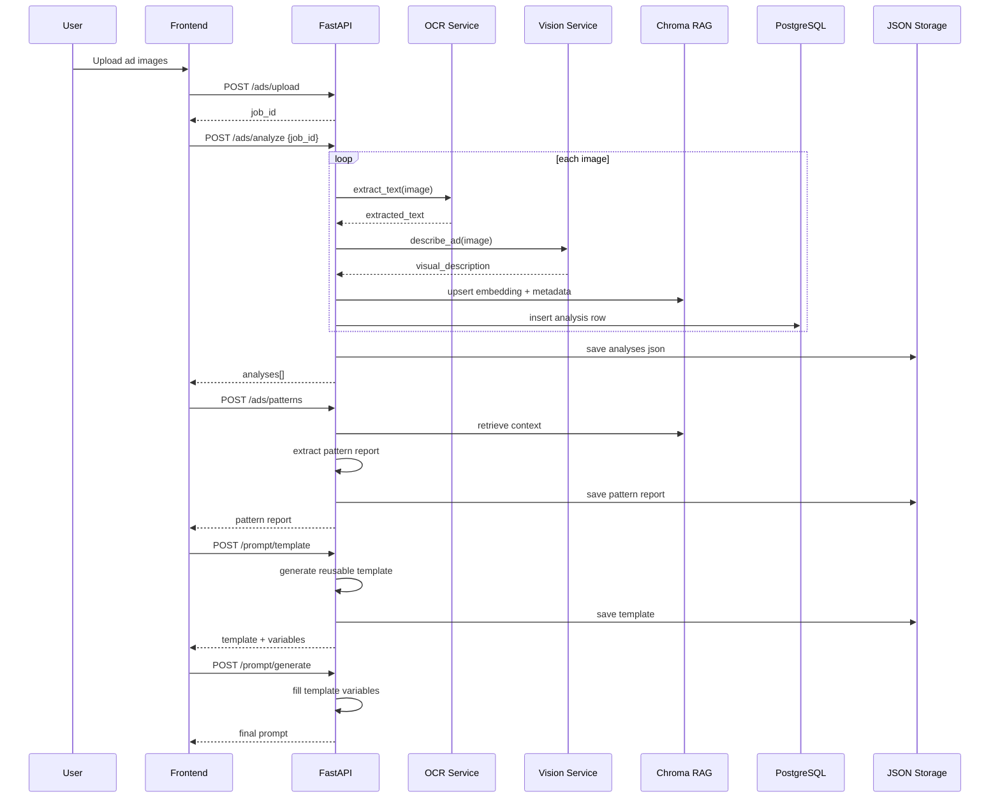

# Ad Prompt Intelligence (Full-Stack)

Ad Prompt Intelligence is a full-stack AI system that learns the creative DNA of static ad images and generates reusable prompt templates for new campaigns.

## 1) Problem Statement

Creative teams often want to produce new ads that feel consistent with previously successful campaigns, but this is hard to scale because:

- Design language is distributed across many image files.
- Ad copy patterns (headlines, CTA style, offer framing) are not structured.
- Visual patterns (layout, palette, style, background treatment) are not indexed for retrieval.
- Prompt engineering for image generation is repeated manually for every product.

This project solves that by converting static ad references into structured, searchable knowledge and turning that knowledge into reusable prompt templates.

## 2) Solution Overview

The system accepts 1-10 ad images (configurable), performs OCR and vision understanding, stores results in both JSON + vector DB + relational metadata, and generates:

- A pattern insight report across all uploaded ads.
- A reusable prompt template with variable placeholders.
- A final prompt for a new product based on user inputs.

The pipeline is resilient to provider throttling with fallback behavior so UI workflows remain usable.

## 3) Key Capabilities

- Drag-and-drop batch image upload with preview.
- OCR extraction of headline/subheadline/CTA/offer/brand text.
- Vision extraction of product type, layout, colors, style, background, extras.
- RAG storage and retrieval via Chroma vector DB.
- Pattern synthesis across uploaded ad set.
- Template generation and template filling for new products.
- Provider abstraction for OpenAI or Gemini.
- Fallback strategy for provider 429/503 errors.

## 4) Tech Stack

### Frontend

- Next.js (App Router)
- React
- Tailwind CSS
- Axios

### Backend

- FastAPI (async)
- Python 3.11+
- OCR: Tesseract + pytesseract
- LLM provider: OpenAI or Gemini
- LangChain + Chroma (vector store)
- PostgreSQL + SQLAlchemy async (metadata)
- Local JSON persistence for intermediate artifacts

## 5) Architecture Diagram



## 6) System Design Diagram



## 7) Repository Structure

```txt
frontend/
  app/
    page.tsx
  components/
    AdUploader.tsx
    AdAnalysisView.tsx
    PromptTemplateView.tsx
    GeneratePromptForm.tsx
  lib/
    api.ts
    types.ts

backend/
  main.py
  routes/
    upload_ads.py
    analyze_ads.py
    generate_prompt.py
  app/
    core/
      config.py
      logging_config.py
    db/
      database.py
      models.py
    schemas/
      ad_schemas.py
    services/
      ocr_service.py
      vision_service.py
      rag_service.py
      pattern_extractor.py
      prompt_generator.py
      storage_service.py
      provider_errors.py
    utils/
      image_utils.py
    vector_db/
      chroma_client.py
      gemini_embeddings.py
  scripts/
    ensure_db.py
    smoke_test_gemini.py
```

## 8) Workflow Details

### Workflow A: Upload

1. Frontend sends multipart images to `/ads/upload`.
2. Backend validates extension and count limits.
3. Files are written to `storage/uploads/{job_id}`.
4. Returns `job_id` and `image_count`.

### Workflow B: Analyze

1. Frontend calls `/ads/analyze` with `job_id`.
2. For each image:
   - OCR extracts textual signals.
   - Vision model extracts structured visual metadata.
3. Each analysis is stored in:
   - Chroma embeddings
   - PostgreSQL row (when DB available)
   - JSON analysis file
4. Returns consolidated analysis array.

Fallback behavior:

- If provider returns 429/503 for an image, the backend inserts a safe placeholder visual description and continues remaining images.

### Workflow C: Patterns

1. Frontend calls `/ads/patterns`.
2. Backend loads analyses from JSON or RAG retrieval.
3. LLM generates pattern report.
4. If provider is rate-limited, backend generates deterministic local fallback report.

### Workflow D: Template + Final Prompt

1. Frontend calls `/prompt/template`.
2. Backend builds reusable template from pattern report.
3. If provider is rate-limited, backend serves deterministic fallback template.
4. Frontend calls `/prompt/generate` with product inputs.
5. Backend fills placeholders and returns final prompt.

## 9) API Design

### GET /health

- Purpose: readiness + DB availability

Response:

```json
{
  "status": "ok",
  "database_available": true
}
```

### POST /ads/upload

- Content-Type: multipart/form-data
- Field: `files`

Response:

```json
{
  "job_id": "bc92f029-c7a3-4064-a8a9-d85c7a4f928f",
  "image_count": 6
}
```

### POST /ads/analyze

Request:

```json
{ "job_id": "bc92f029-c7a3-4064-a8a9-d85c7a4f928f" }
```

Success Response:

```json
{
  "analyses": [
    {
      "image_id": "4891aa65-80a1-44d0-9d6c-e068fd55cf9c",
      "image_path": "storage/uploads/.../ad_1.png",
      "extracted_text": {
        "headline": "Glow Better Skin",
        "subheadline": "Hydration that lasts all day",
        "cta": "Shop Now",
        "offer": "20% Off",
        "brand_name": "Lumina"
      },
      "visual_description": {
        "product_type": "skincare serum",
        "layout": "product center, text top, cta bottom",
        "colors": ["peach", "cream", "gold"],
        "style": "minimal luxury",
        "background": "soft gradient",
        "extras": ["water splash", "leaf props"]
      }
    }
  ]
}
```

Rate-limited partial behavior:

- The endpoint can still return 200 with placeholder `visual_description` for affected images.

### POST /ads/patterns

Request:

```json
{ "job_id": "bc92f029-c7a3-4064-a8a9-d85c7a4f928f" }
```

Response:

```json
{
  "summary": "Generated using local fallback because model provider was temporarily rate-limited.",
  "common_layouts": ["..."],
  "recurring_palettes": ["..."],
  "style_patterns": ["..."],
  "copy_tone": "short, benefit-focused",
  "cta_patterns": ["Shop Now"]
}
```

### POST /prompt/template

Request:

```json
{ "job_id": "bc92f029-c7a3-4064-a8a9-d85c7a4f928f" }
```

Response:

```json
{
  "template": "Create a clean modern ad for [PRODUCT_NAME]...",
  "variables": ["[PRODUCT_NAME]", "[PRODUCT_BENEFIT]", "[CTA_TEXT]", "[TARGET_AUDIENCE]", "[HEADLINE]"]
}
```

### POST /prompt/generate

Request:

```json
{
  "job_id": "bc92f029-c7a3-4064-a8a9-d85c7a4f928f",
  "inputs": {
    "product_name": "HydraGlow Serum",
    "product_benefit": "deep hydration in 24 hours",
    "cta_text": "Shop Now",
    "target_audience": "women aged 22-35"
  }
}
```

Response:

```json
{
  "prompt": "Create a clean modern ad for HydraGlow Serum..."
}
```

## 10) Configuration

### Backend .env

- `AI_PROVIDER`: `openai` or `gemini`
- `OPENAI_API_KEY`
- `OPENAI_MODEL`
- `VISION_MODEL`
- `GEMINI_API_KEY`
- `GEMINI_MODEL`
- `GEMINI_FALLBACK_MODEL`
- `GEMINI_VISION_MODEL`
- `GEMINI_EMBEDDING_MODEL`
- `DATABASE_URL`
- `REQUIRE_DATABASE`
- `MIN_UPLOAD_IMAGES`
- `MAX_UPLOAD_IMAGES`
- `CHROMA_PERSIST_DIR`
- `ANALYSIS_OUTPUT_DIR`
- `UPLOAD_DIR`
- `TESSERACT_CMD`

### Frontend .env.local

- `NEXT_PUBLIC_API_BASE_URL`
- `NEXT_PUBLIC_MIN_UPLOAD_IMAGES`
- `NEXT_PUBLIC_MAX_UPLOAD_IMAGES`

## 11) Local Setup and Run

### Backend

```bash
cd backend
python -m venv .venv
.venv\Scripts\activate
pip install -r requirements.txt
copy .env.example .env
uvicorn main:app --reload --port 8000
```

### Frontend

```bash
cd frontend
npm install
copy .env.example .env.local
npm run dev
```

### Quick smoke test (Gemini)

```bash
cd backend
.venv\Scripts\python scripts\smoke_test_gemini.py
```

## 12) Error Handling and Resilience

- Upload validation for invalid extension/count.
- Database optional startup mode (`REQUIRE_DATABASE=false`).
- AI provider errors mapped to explicit HTTP statuses.
- Redaction of provider key query params in error messages.
- Partial processing and deterministic fallbacks for 429/503.

## 13) Known Limitations

- Free-tier Gemini may return intermittent 429/503.
- Chroma telemetry warning may appear in logs (`capture() takes 1 positional argument but 3 were given`) but does not block core flow.
- OCR quality depends on input resolution and text contrast.

## 14) Future Improvements

- Add retry queue for failed images instead of single-pass fallback.
- Add per-image status visibility in frontend timeline.
- Add caching for repeated image analyses.
- Add auth, multi-tenant workspaces, and audit logs.
- Add prompt quality scoring and A/B comparison tools.

## 15) Security Notes

- Never commit real API keys.
- Rotate keys immediately if exposed.
- Keep `.env` files out of version control.
